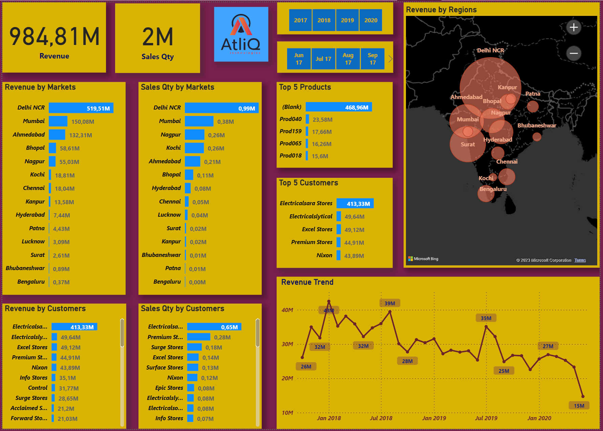
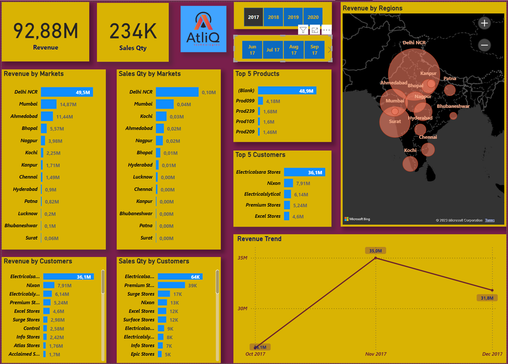
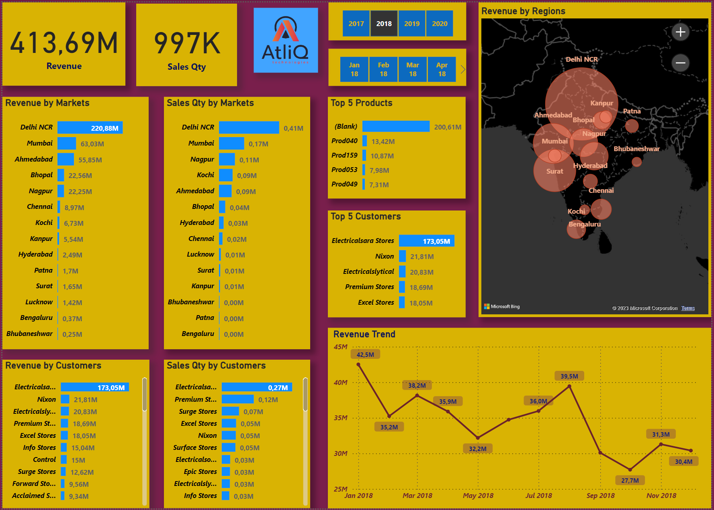
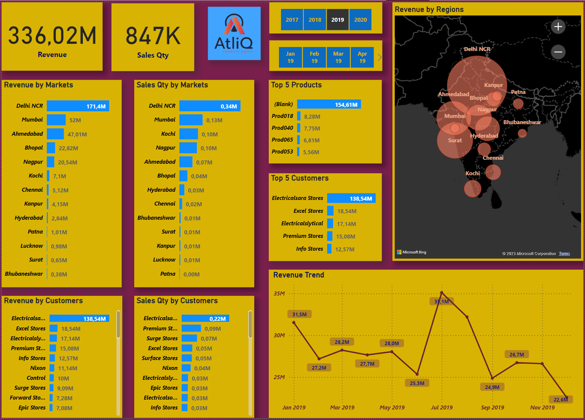
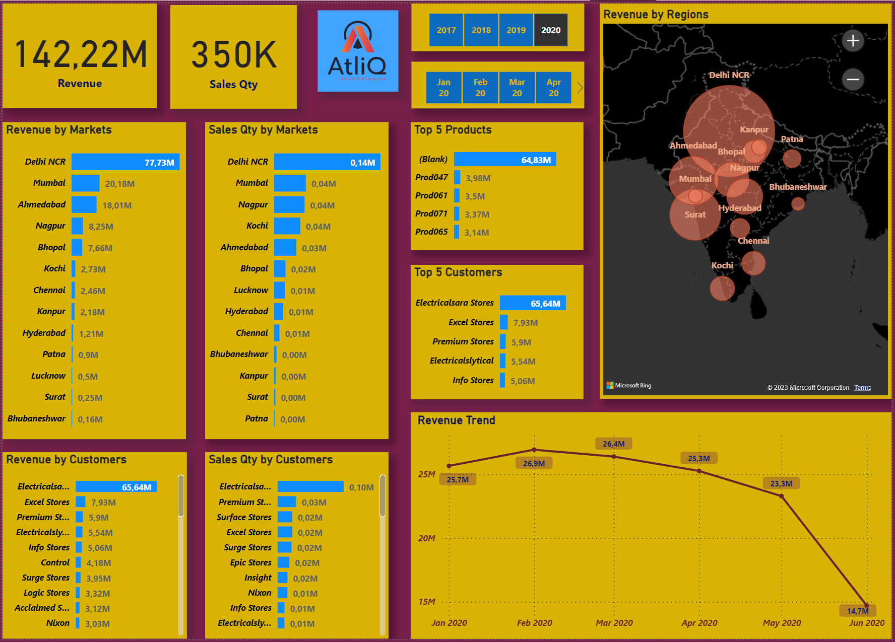
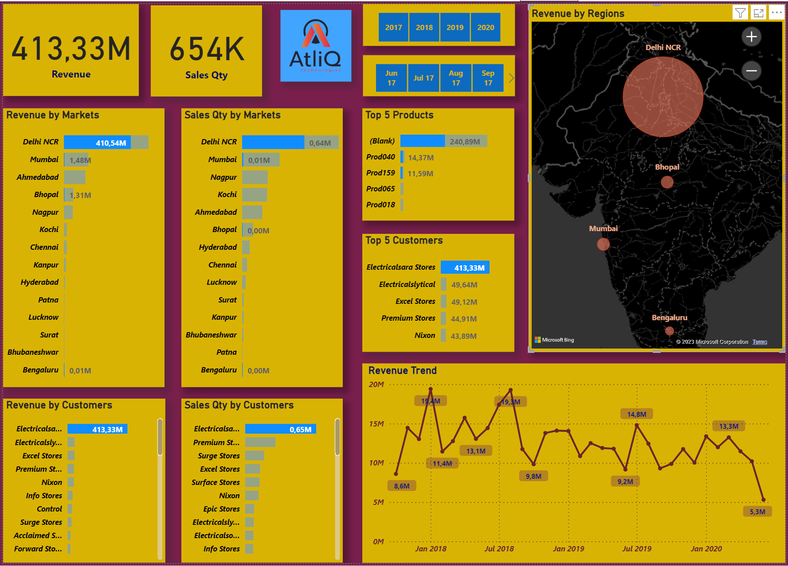
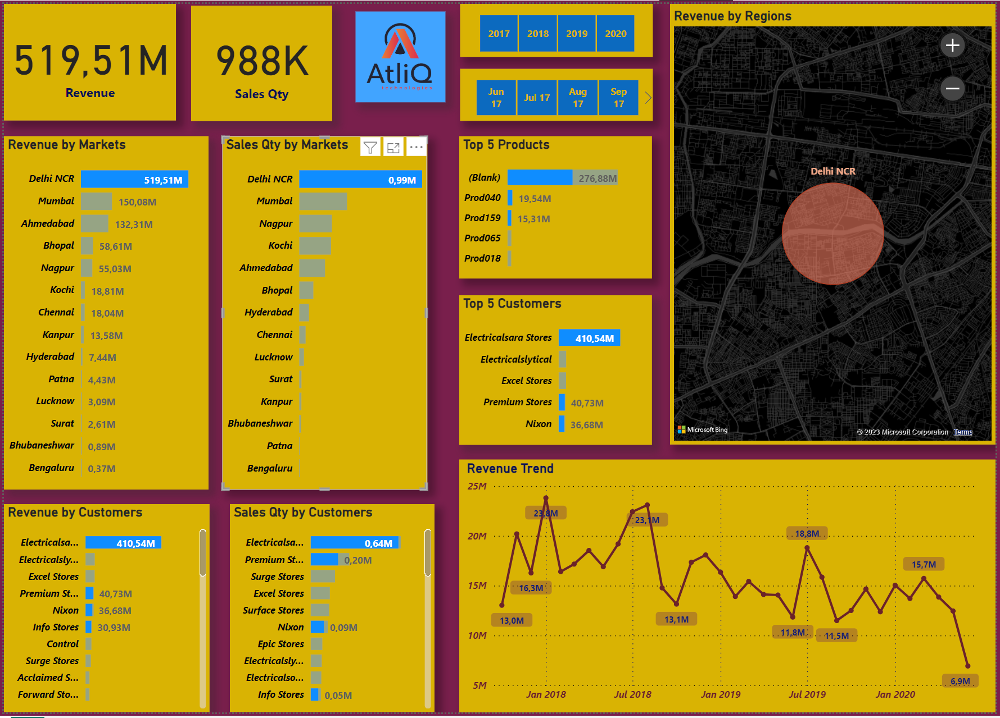

# Atliq Sales Insights Data Analysis and Visualization.
The Atliq Sales Insights Data Analysis and Visualization project combines SQL and MySQL for data analysis, Power Query Editor for data transformation, and Power BI for creating interactive visualizations.

## Project Details

- **Data Sources**: Sales data from a Atliq (Codebasics).
- **Objective**: Analyze sales transactions, currencies, and visualize revenue trends over time.

## Overall Revenue

*Total Revenue from Jan 2018 to Jan 2020. Revenue by Markets and Customers, Sales Quantities by Markets and Customers, Top 5 demanding products, Top 5 customers, trend chart, geographical view of revenue by regions.*

## Revenue over different years

 
*Total Revenue of 2017*
*Total Revenue of 2018*
 

*Total Revenue of 2019*
 

*Total Revenue of 2020*

## Revenue by top 1 customer.

## Reveunue of Top demanding City 'Delhi NCR'.

### Many Thanks to Dhaval Patel from Codebasics.
